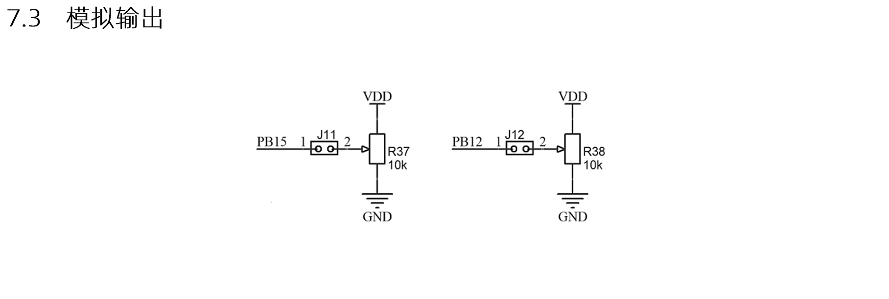
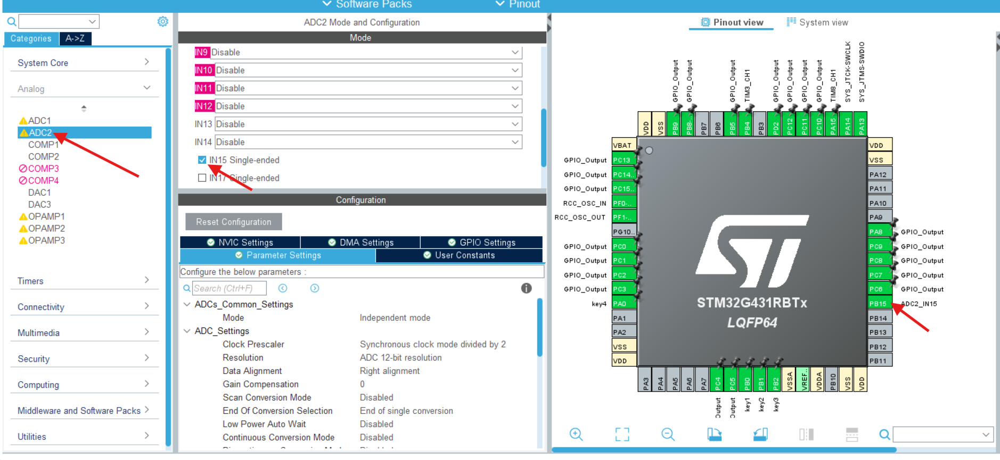
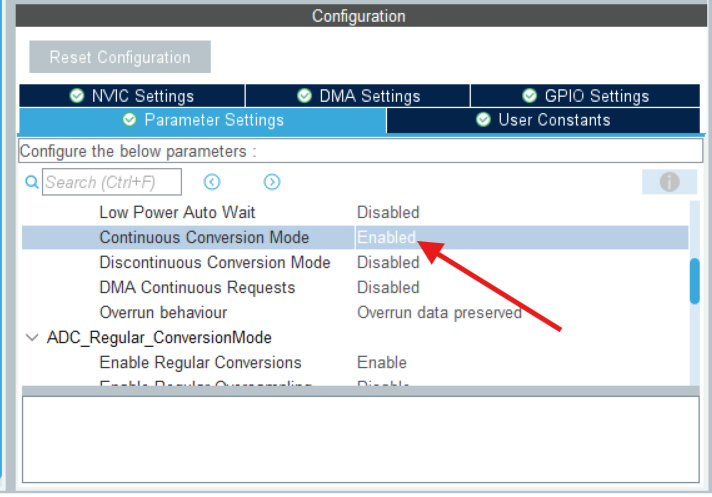
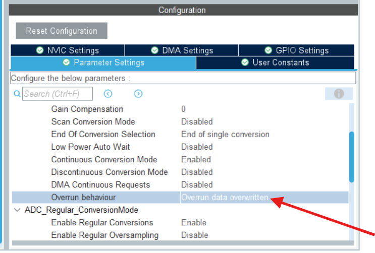

# STM32开发备忘录：ADC 模拟量采集指南

## 1. 硬件引脚映射分析

通过查阅开发板原理图可知，板载电位器的模拟电压输出分别连接在 **PB15** 和 **PB12** 引脚。
* 以 **PB15** 为例，查阅 STM32G431 的引脚复用表可知，它在内部连接至 **ADC2 的 IN15 通道** (ADC2_IN15)。
* *(注：在查阅原理图时，请结合考场或项目实际给定的图纸进行二次确认。)*

---

## 2. STM32CubeMX 基础配置

在 STM32CubeMX 中，我们需要开启对应的 ADC 通道并配置转换模式：

1. **开启通道**：在左侧 `Analog` 菜单栏中选择 `ADC2`，勾选 `IN15 Single-ended`（单端输入模式）。
2. **配置转换模式**：在下方 Parameter Settings 中，找到 `Continuous Conversion Mode`（连续转换模式），将其设置为 **Enable**。
   * *开启此模式后，ADC 在启动后会自动、连续地进行模数转换，无需每次读取前都重新触发。*


---

## 3. 核心代码编写与浮点数处理

### 3.1 ADC 启动与数据读取
由于开启了连续转换模式，只需在系统初始化阶段启动一次 ADC 即可。

```c
/* USER CODE BEGIN 2 */
// 初始化完毕后，启动 ADC2
HAL_ADC_Start(&hadc2);
/* USER CODE END 2 */
```

在主循环中，直接读取 ADC 寄存器的数据并换算为电压：

```c
static float ADC_Value = 0; // 存放换算后的电压值

while(1) 
{
    // 1. 读取 ADC 原始转换数值 (0 - 4095)
    uint32_t adc_raw = HAL_ADC_GetValue(&hadc2);
    
    // 2. 将原始值换算为实际电压值 (极其重要的格式化转换)
    ADC_Value = (adc_raw / 4096.0f) * 3.3f;
    
    // 或者使用强制类型转换的写法：
    // ADC_Value = (adc_raw / (float)4096) * 3.3f;
    
    HAL_Delay(100); // 延时防止主循环跑飞或屏幕刷新过快
}
```

> **⚠️ 避坑点 1：浮点数除法陷阱**
> 在计算公式 `(adc_raw / 4096.0) * 3.3` 中，**`4096.0` 结尾的 `.0` 绝对不可以省略！** 如果写成 `4096`，C 语言会将其视为整数除法，由于 `adc_raw` 最大为 4095，结果永远是 `0`，导致最终算出的电压值始终为 0。

### 3.2 浮点数格式化与 LCD 动态显示

如果需要将包含小数的 `ADC_Value` 结合 LCD 显示在屏幕上，通常会使用 `sprintf`。**这里存在一个极其重要的工具链差异：**

如果你使用的是 **Keil5 (MDK)** 架构，默认支持浮点打印，无需额外配置，直接使用即可。
如果你使用的是基于 **CMake** 的现代 IDE 架构（如 CLion、VSCode + GCC 等），默认的 C 运行库为了压缩代码体积，关闭了浮点打印支持。必须在 `CMakeLists.txt` 中强制开启浮点数输出与硬件 FPU 支持：

```cmake
# 在 CMakeLists.txt 中添加以下编译链接参数
set(CMAKE_C_FLAGS "${CMAKE_C_FLAGS} -mfpu=fpv4-sp-d16 -mfloat-abi=hard")
set(CMAKE_CXX_FLAGS "${CMAKE_CXX_FLAGS} -mfpu=fpv4-sp-d16 -mfloat-abi=hard")
target_link_options(${PROJECT_NAME} PRIVATE -u _printf_float)
```

配置完成后，即可利用 `sprintf` 的占位符补齐技巧，将电压值平滑显示在屏幕上（无残影）：

```c
char LCD_DataTemp[30];
char LCD_DataLine1[30];

// 格式化输出电压值，保留两位小数
sprintf(LCD_DataTemp, "    ADC1 = %.2f V", ADC_Value);

// 使用 %-20s 左对齐并自动补齐 20 个字符长度，消除旧数据残影
sprintf(LCD_DataLine1, "%-20s", LCD_DataTemp);

// 显示到 LCD 第一行
LCD_DisplayStringLine(Line1, (uint8_t*)LCD_DataLine1);
```

---

## 4. ☢️ 终极避坑指南：ADC 读数只刷新一次的玄学 Bug

### 4.1 故障现象
代码编译下载后，发现 LCD 上显示的 ADC 电压值 **只在上电的一瞬间有数值，旋动电位器后数值不再发生变化（卡死）**。

### 4.2 故障原因 (Overrun 机制)
由于我们在 CubeMX 中开启了 **Continuous Conversion Mode（连续转换模式）**，ADC 的硬件转换速度极快。而我们在主循环 `while(1)` 中加入了 `HAL_Delay(100)`。
这意味着：ADC 已经完成了成百上千次转换，但 CPU 每隔 100ms 才去取一次数据。
当 ADC 发现自己转换好的新数据“没有被及时拿走”，而上一次的数据还卡在数据寄存器中时，就会触发 **Overrun (溢出) 错误**。默认配置下，一旦发生 Overrun，ADC 硬件会为了保护旧数据而**停止后续的所有转换**，导致我们只能读到第一次的死数据。

### 4.3 终极解决方案
通常解决连续大批量数据的搬运会使用 DMA，但为了节省配置时间和降低复杂度，我们可以直接通过修改 ADC 的溢出行为来解决：

1. 重新打开 STM32CubeMX，进入 ADC2 的配置界面。
2. 找到 `ADC_Regular_ConversionMode` 菜单下的 **`Overrun behaviour`** 选项。
3. 将默认的 `Overrun data preserved`（保留旧数据并停机）更改为 **`Overrun data overwritten`（新数据覆盖旧数据）**。

*(配置完成后，重新生成代码并编译下载，ADC 即可完美、顺滑地连续采集电压，不再卡死！)*