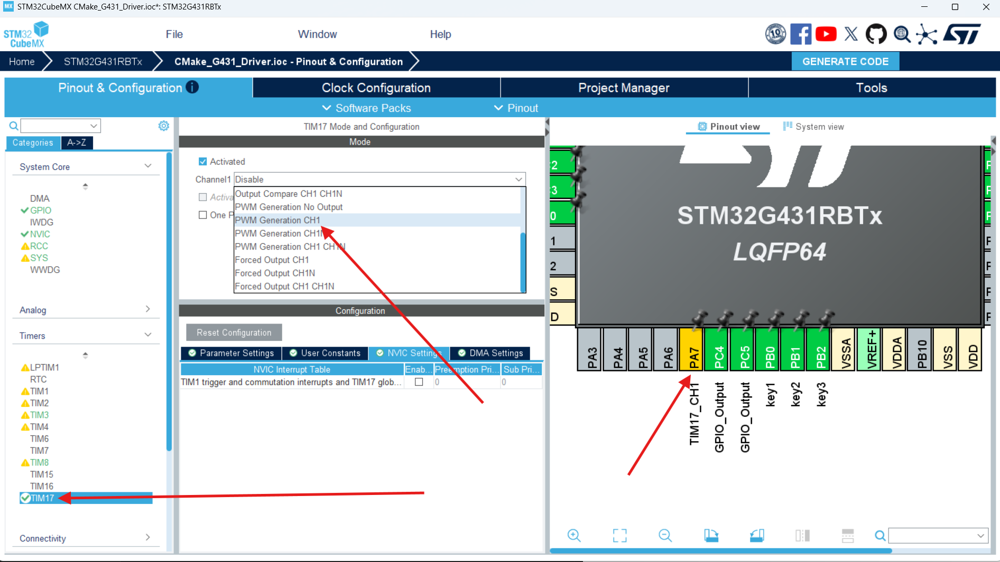
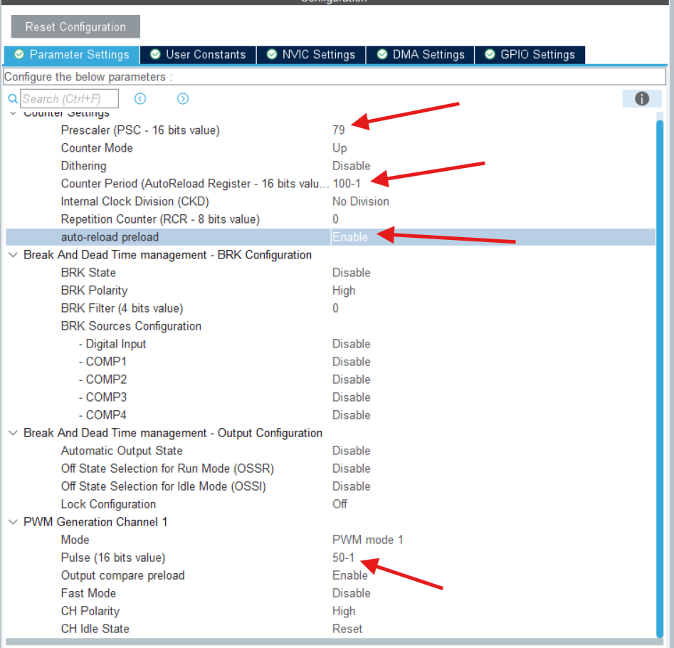

# STM32开发备忘录：硬件PWM调制输出与动态调参

在各类嵌入式比赛和日常项目开发中，PWM（脉冲宽度调制）论用途广泛程度绝对占有一席之地。无论是电机调速、LED 呼吸灯还是 DAC 模拟输出，都离不开它。

硬件 PWM 输出无需复杂的软件干预，只需单片机最小系统板即可完成。本文基于 STM32G431 平台，梳理 PWM 的配置、验证以及寄存器级的动态调参技巧。

---

## 1. 硬件引脚映射与选择

首先查看开发板引脚映射表，找到支持定时器通道输出的引脚。
* 这里以 **PA7** 为例，它对应 `TIM17_CH1` 和 `TIM3_CH2`。
* **资源分配策略**：因为前面的项目中我们将 `TIM3` 分配给了输入捕获（测频率），为了避免外设冲突，这里选择配置 **TIM17 的通道 1** 来输出 PWM。


---

## 2. STM32CubeMX 核心配置与参数计算

打开 CubeMX，进入 TIM17 配置界面：
1. **Mode**：将 Channel 1 设置为 `PWM Generation CH1`。
2. **Parameter Settings**（假设系统主频为 80MHz）：
   * `Prescaler` (PSC, 分频系数) = **80 - 1** (即 79)
   * `Counter Period` (ARR, 自动重装载值) = **100 - 1** (即 99)
   * `Pulse` (CCR1, 比较寄存器值) = **50 - 1** (即 49)

> **⚠️ 注意事项：**
> 定时器硬件计数是从 0 开始的，所以填入寄存器的值**全部都需要减 1**。



### 2.1 理论计算公式
* **频率 (Frequency)**：$Freq = \frac{F_{clk}}{(PSC+1) \times (ARR+1)}$
  * 本例频率：$80,000,000 / (80 \times 100) = 10,000 \text{ Hz} = 10 \text{ kHz}$
* **占空比 (Duty Cycle)**：$Duty = \frac{CCR}{ARR+1} \times 100\%$
  * 本例占空比：$50 / 100 \times 100\% = 50\%$

---

## 3. 核心初始化与“无示波器”验证法

在 `main.c` 中开启 PWM 输出：

```c
/* USER CODE BEGIN 2 */
// 开启 TIM17 通道 1 的 PWM 输出
HAL_TIM_PWM_Start(&htim17, TIM_CHANNEL_1);
/* USER CODE END 2 */
```

编译下载后，PA7 已经在输出 PWM 波了。如果手头没有示波器，可以使用以下两种极具实战价值的**“单片机自校验法”**：

1. **频率自校验 (环回法)**：用一根杜邦线，将 PA7（PWM输出）短接到你之前写的“计频器”输入引脚（如 PA15）。直接在 LCD 上观测测得的频率是否为 10kHz。
2. **占空比自校验 (ADC法)**：将 PA7 接一个简单的 RC 滤波电路（或者利用板载电容的积分效应），接到 ADC 采集引脚上测电压。
   * $Duty = \frac{V_{测得电压}}{3.3V} \times 100\%$

---

## 4. 动态调参 (结合电位器)

在实际赛题中，经常要求通过电位器（ADC 旋钮）实时改变 PWM 的频率或占空比。相比于调用冗长的 HAL 库函数，**直接操作寄存器**是最快、最高效的方法。

以下是使用 ADC 采集值（0~4095）控制 TIM17 输出的经典案例：

```c
// 获取 ADC1 采集的原始数值 (0~4095)
uint32_t ADC_R = HAL_ADC_GetValue(&hadc2);

/* ==============================================================
 * 1. 动态改变频率 (通过修改 PSC)
 * 目标：将电位器 0~4095 的值映射到 1000Hz ~ 2000Hz 的目标频率
 * 数学推导：已知 Freq = 80M / (PSC * 100)，则 PSC = 800,000 / Freq
 * ============================================================== */

// 【模式 A：离散跳变】(纯整数运算，省资源，但有阶梯感)
// 4096/11 约等于 372。ADC_R / 372 将数值划分为 0~11 共 12 个档位。
// 映射后的目标频率为 1000, 1100, 1200...2000 Hz
TIM17->PSC = 800000 / ((ADC_R / (4096 / 11)) * 100 + 1000); 

// 【模式 B：连续无级变化】(加入浮点运算，过渡丝滑平滑)
// 必须加 .0 强制转换为浮点数运算，否则 C 语言会按整数截断丢失精度
TIM17->PSC = 800000.0f / ((ADC_R / (4096.0f / 11.0f)) * 100.0f + 1000.0f);


/* ==============================================================
 * 2. 动态改变占空比 (通过修改 CCR1)
 * 目标：将电位器 0~4095 的值映射到 0~100 的占空比
 * ============================================================== */

// 【离散跳变】只有 11 个阶梯档位 (0%, 10%, 20%...)
TIM17->CCR1 = (ADC_R / (4096 / 11)) * 10;

// 【连续无极变化】映射范围 0~100%，细腻调节
// 算法等效于：CCR1 = (ADC_R / 4096.0) * 100.0;
TIM17->CCR1 = (ADC_R / (4096.0f / 11.0f)) * 10.0f; 
```

通过直接操作 `TIM17->PSC` 和 `TIM17->CCR1`，配合 C 语言的强制浮点转换，我们完美实现了硬件 PWM 参数的无缝实时更新。