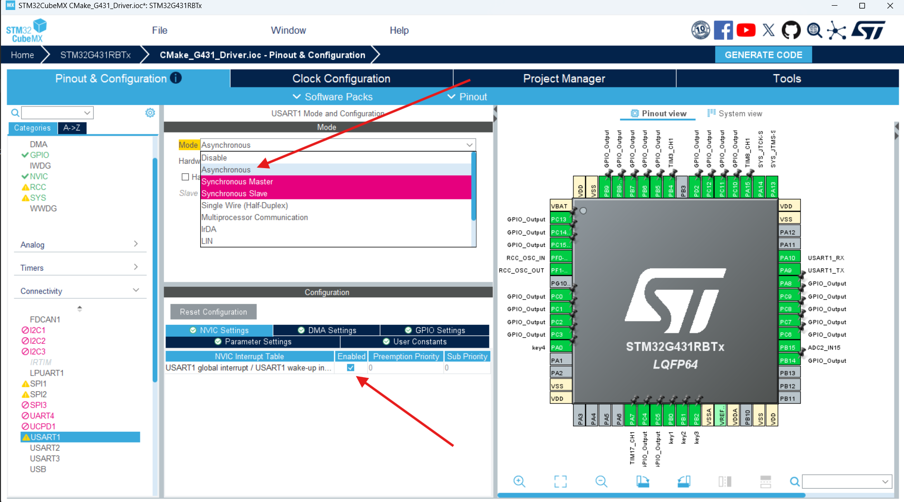
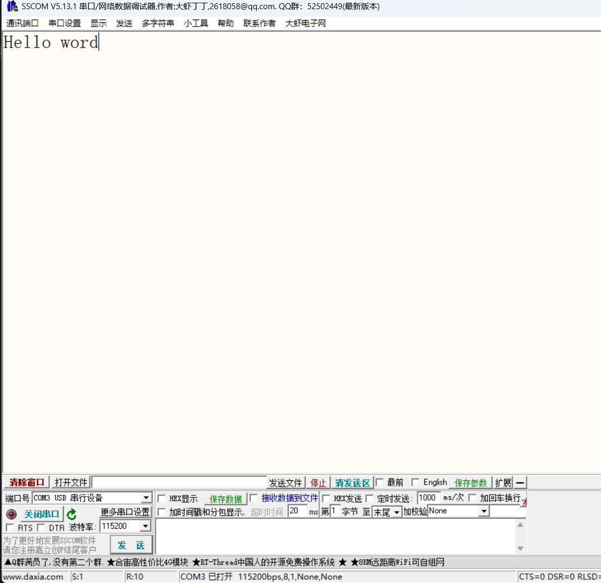

# STM32开发备忘录：USART串口通信与中断收发底层实现

在嵌入式开发与调试过程中，串口通信是最基础也最重要的外设之一。通过串口打印数据，我们可以极大地便利程序运行状态的监控与 Bug 排查。

本文基于 STM32G431 平台，梳理如何利用 HAL 库实现基于**中断机制（IT）**的串口数据的收发。

> **🛠️ 前置准备：**
> 在开始编写代码前，请确保你的电脑已经正确安装了 **CH340 / CP2102 等 USB 转串口驱动**，否则电脑上的串口助手将无法识别到开发板。

---

## 1. STM32CubeMX 核心配置

打开工程，找到 `Connectivity` -> `USART1`（根据开发板原理图确认，蓝桥杯板载 DAP 虚拟串口通常连接在 USART1，对应引脚 PA9 / PA10）。

1. **工作模式**：将 Mode 设置为 **`Asynchronous` (异步收发模式)**。
2. **参数设置 (Parameter Settings)**：
   * `Baud Rate` (波特率)：默认为 **115200**（或 9600，需与电脑端串口助手保持绝对一致）。
   * `Word Length` (数据位)：8 Bits。
   * `Parity` (校验位)：None。
   * `Stop Bits` (停止位)：1。
3. **开启中断 (NVIC Settings)**：
   * 必须勾选 **`USART1 global interrupt`**，否则后续代码中的 `_IT` 后缀函数将无法触发回调。


---

## 2. 串口数据发送 (Transmit)

在 `main.c` 中，我们可以直接调用 `HAL_UART_Transmit_IT()` 函数以非阻塞的中断方式发送一串数据。

```c
/* USER CODE BEGIN 2 */
// 定义要发送的字符串数组
uint8_t tx_buffer[] = "Hello World\r\n";

// 调用中断发送函数 (非阻塞式)
// 参数：串口句柄，数据指针，数据长度
HAL_UART_Transmit_IT(&huart1, tx_buffer, sizeof(tx_buffer));
/* USER CODE END 2 */
```
*编译下载后，打开电脑端的串口助手，设置好对应的端口号和波特率，复位开发板即可看到打印信息。*


---

## 3. 串口数据接收与回显 (Receive with Loopback)

基于中断的串口接收，核心逻辑在于：**主函数启动第一次接收 -> 触发中断回调 -> 在回调中处理数据 -> 再次启动接收。**

### 3.1 启动首次接收
在进入 `while(1)` 之前，必须手动触发一次接收中断，让单片机处于“待命”状态。

```c
volatile uint8_t rx_buffer[10]; // 定义接收缓存区 (volatile 防止被编译器优化掉)

/* USER CODE BEGIN 2 */
// 开启第一次中断接收，期待接收 10 个字节的数据
HAL_UART_Receive_IT(&huart1, (uint8_t *)rx_buffer, sizeof(rx_buffer));
/* USER CODE END 2 */
```

### 3.2 编写中断回调函数
当单片机接收满 10 个字节后，会自动进入硬件中断，并最终调用 `HAL_UART_RxCpltCallback` 弱函数。我们需要重写这个函数。

```c
/* USER CODE BEGIN 4 */
// 串口接收完成回调函数
void HAL_UART_RxCpltCallback(UART_HandleTypeDef *huart)
{
    // 判断是否是 USART1 触发的中断
    if (huart->Instance == USART1)
    {
        // 业务逻辑：将接收到的数据原封不动地发回去 (Echo 回显)
        HAL_UART_Transmit_IT(&huart1, (uint8_t *)rx_buffer, sizeof(rx_buffer));
        
        // ⚠️ 极其重要：重新“武装 (Re-arm)”接收中断
        // HAL 库机制决定了每次接收完成后，中断会被关闭。必须再次调用以下函数开启下一轮接收。
        HAL_UART_Receive_IT(&huart1, (uint8_t *)rx_buffer, sizeof(rx_buffer));
    }
}
/* USER CODE END 4 */
```

---

## 4. ⚠️ 调试避坑指南与进阶预告

1. **波特率对齐**：**“使用串口的时候尤其要注意波特率有没有设置正确！”** 电脑端串口助手、CubeMX 配置两者的波特率必须严丝合缝。出现乱码 99% 都是波特率不匹配或是晶振频率（时钟树）配置错误导致的。
2. **定长接收的局限性**：上述 `sizeof(rx_buffer)` 的写法是**定长接收**。如果缓存区设为 10，但上位机只发了 8 个字节，单片机是不会进入回调函数的，它会一直傻等剩下的 2 个字节。
3. **进阶预告**：为了解决不定长数据（比如有时候发 "OK"，有时候发 "ERROR"）的接收痛点，在更高级的工程开发中，我们会结合 **DMA 数据搬运** 与 **串口空闲中断 (IDLE Interrupt)** 来实现**不定长数据收发**。这部分内容将在后续篇幅中详细展开。