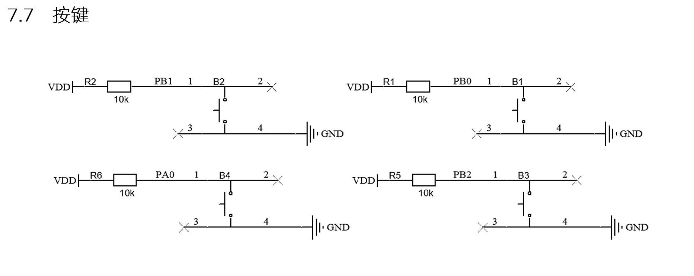
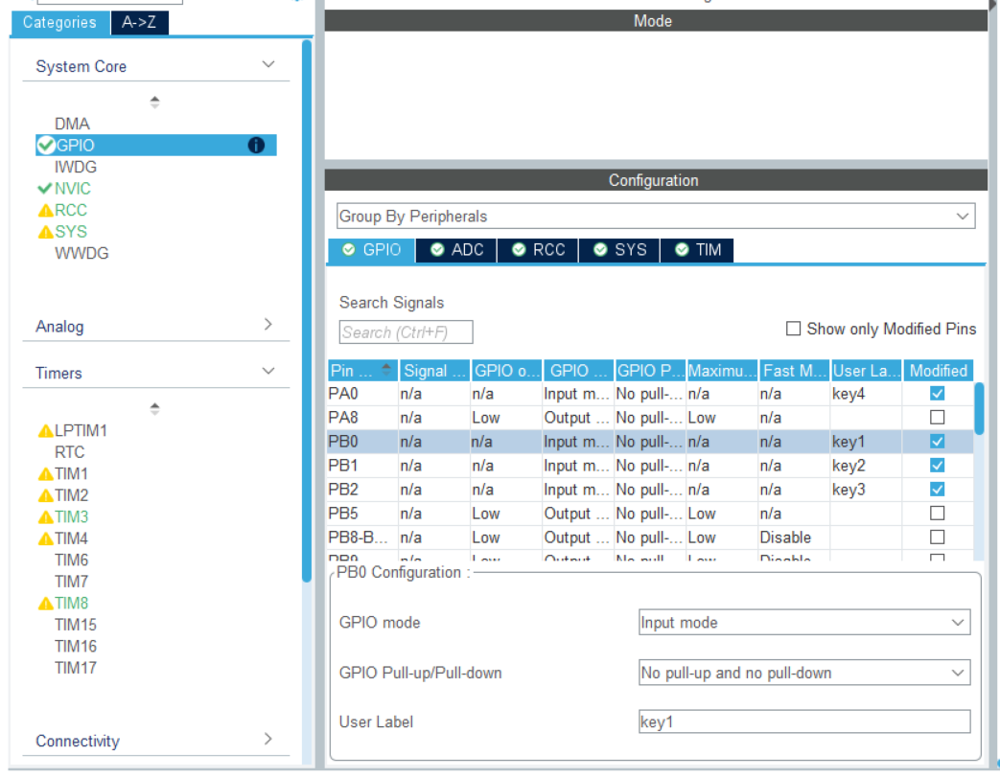

# STM32开发备忘录：快速易用的按键扫描底层模板

按键作为最基本的人机交互外设，无论是日常项目开发还是各类嵌入式比赛，都是必须熟练掌握的核心部分。

本文基于蓝桥杯 STM32G431 平台，搭建一个快速、易用且防阻塞的按键扫描底层，支持**按下、抬起、短按、长按**的逻辑判断。

---

## 1. 硬件连接与引脚分析

首先查看开发板原理图，确认四个独立按键的引脚连接：


蓝桥杯主板上的四个按键分别对应：**PB0、PB1、PB2、PA0**。
由于硬件电路上已经接了上拉电阻，按键未按下时为高电平（1），按下时为低电平（0）。

## 2. STM32CubeMX 基础配置

在 CubeMX 中，将 `PB0`, `PB1`, `PB2`, `PA0` 这四个引脚配置为 **GPIO_Input**（输入模式）。
* **GPIO Pull-up/Pull-down**：保持默认的 `No pull-up and no pull-down` 即可（硬件已自带上拉，无需软件重复配置）。


---

## 3. 核心驱动代码 (类状态机数组法)

在限时比赛中，直接套用以下数组加循环的“类状态机”模板，可以将 4 个按键的逻辑合并处理，极大减少代码冗余。

```c
// 按键状态记录数组
static uint8_t key_Value[4]     = {1, 1, 1, 1}; // 当前电平状态
static uint8_t key_lastValue[4] = {1, 1, 1, 1}; // 上一次电平状态
static uint32_t key_longState[4] = {0, 0, 0, 0}; // 记录按下的时间戳
static uint8_t keyLongSign[4]   = {0, 0, 0, 0}; // 长按触发标志位

void key_scan(void)
{
    // 1. 读取当前四个按键的实时电平
    key_Value[0] = HAL_GPIO_ReadPin(GPIOB, GPIO_PIN_0);
    key_Value[1] = HAL_GPIO_ReadPin(GPIOB, GPIO_PIN_1);
    key_Value[2] = HAL_GPIO_ReadPin(GPIOB, GPIO_PIN_2);
    key_Value[3] = HAL_GPIO_ReadPin(GPIOA, GPIO_PIN_0);
    
    // 2. 遍历四个按键进行逻辑判断
    for(int i = 0; i < 4; i++)
    {
        // ==========================================
        // 状态 1：检测到下降沿 (按键被按下)
        // ==========================================
        if (key_Value[i] == 0 && key_lastValue[i] == 1)
        {
            HAL_Delay(5); // 软件消抖延时 
            
            // 再次确认引脚电平
            switch(i)
            {
                case 0: key_Value[0] = HAL_GPIO_ReadPin(GPIOB, GPIO_PIN_0); break;
                case 1: key_Value[1] = HAL_GPIO_ReadPin(GPIOB, GPIO_PIN_1); break;
                case 2: key_Value[2] = HAL_GPIO_ReadPin(GPIOB, GPIO_PIN_2); break;
                case 3: key_Value[3] = HAL_GPIO_ReadPin(GPIOA, GPIO_PIN_0); break;
                default: break;
            }
            
            // 确认真的是按下了
            if (key_Value[i] == 0 && key_lastValue[i] == 1)
            {
                key_lastValue[i] = key_Value[i]; // 更新历史状态
                keyLongSign[i] = 0;              // 清除长按标志位
                
                // 处理【按下瞬发逻辑】
                switch (i)
                {
                    case 0:
                        key_longState[0] = HAL_GetTick(); // 记录按下时刻的时间戳，为长按做准备
                        count++; // 示例：按下即加一
                        break;
                    case 1:
                        key_longState[1] = HAL_GetTick();
                        break;
                    case 2:
                        key_longState[2] = HAL_GetTick();
                        break;
                    case 3:
                        key_longState[3] = HAL_GetTick();
                        break;
                }
            }
        }
        
        // ==========================================
        // 状态 2：检测到上升沿 (按键被抬起)
        // ==========================================
        if (key_Value[i] == 1 && key_lastValue[i] == 0)
        {
            HAL_Delay(5); // 软件消抖
            
            switch(i)
            {
                case 0: key_Value[0] = HAL_GPIO_ReadPin(GPIOB, GPIO_PIN_0); break;
                case 1: key_Value[1] = HAL_GPIO_ReadPin(GPIOB, GPIO_PIN_1); break;
                case 2: key_Value[2] = HAL_GPIO_ReadPin(GPIOB, GPIO_PIN_2); break;
                case 3: key_Value[3] = HAL_GPIO_ReadPin(GPIOA, GPIO_PIN_0); break;
                default: break;
            }
            
            if (key_Value[i] == 1 && key_lastValue[i] == 0)
            {
                key_lastValue[i] = key_Value[i]; // 更新历史状态
                
                // 处理【抬起逻辑 / 短按判定】
                switch (i)
                {
                    case 0:
                        // 如果需要区分长短按：在这里判断 keyLongSign[0] 是否为 0
                        // 如果为 0，说明没触发过长按，这里就执行短按逻辑
                        break;
                    case 1: break;
                    case 2: break;
                    case 3: break;
                }
                
                keyLongSign[i] = 0; // 抬起后重置长按标志
            }
        }
        
        // ==========================================
        // 状态 3：持续保持低电平 (长按检测)
        // ==========================================
        if (key_Value[i] == 0 && key_lastValue[i] == 0)
        {
            // 如果当前时间距离按下时刻超过了 1000ms (1秒)
            if (HAL_GetTick() - key_longState[i] > 1000)
            {
                keyLongSign[i] = 1; // 标记已触发长按
                
                switch (i)
                {
                    case 0:
                        count++; // 示例：长按时数值累加
                        
                        // 【连续触发 vs 单次触发】核心逻辑：
                        // 如果希望长按时数据“持续快速累加”，就在这里将 key_longState[0] 加上一定的时间补偿，或者重置为当前 HAL_GetTick()。
                        // 这里演示重置标志位使其能在下一次循环继续触发：
                        keyLongSign[0] = 0; 
                        key_longState[0] = HAL_GetTick() - 900; // 留 100ms 余量，实现每 100ms 连加一次
                        break;
                    case 1: break;
                    case 2: break;
                    case 3: break;
                }
            }
        }
    }
}
```

---

## 4. 逻辑进阶与工程化建议

### 4.1 长短按冲突处理
若按键具有**短按**和**长按**两种不同功能，需要利用 `keyLongSign` 标志位进行隔离：
* **短按逻辑**：必须放在**状态 2（按键抬起）**中处理。在抬起时判断，如果 `keyLongSign[i] == 0`，说明未达到长按时间，触发短按功能。
* **长按逻辑**：在**状态 3（长按检测）**中处理。一旦触发，将 `keyLongSign[i]` 置为 1，这样在按键抬起时就不会误触短按功能。

### 4.2 比赛与工程开发区别
在限时比赛中，直接将此模板套用，并在 `switch` 分支中填充业务逻辑是最稳妥、最快速的做法。

**工程应用注意**：
尽管此写法紧凑，但其中使用了 `HAL_Delay(5)` 阻塞延时，且业务逻辑与底层扫描耦合在了一起。在实际的商业工程应用中，极其不建议这种写法。通常会引入**基于定时器中断的三段式状态机**（按下消抖->确认按下->释放消抖），结合回调函数或事件标志组来实现真正的非阻塞按键解耦。这一点将在后续文章中具体探讨。