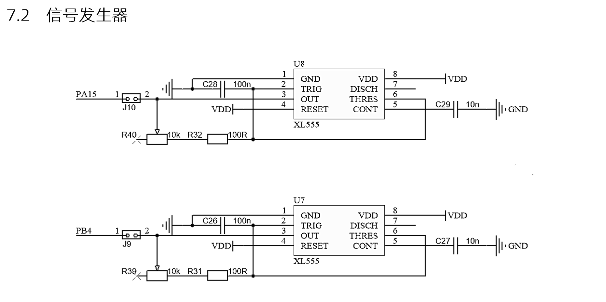
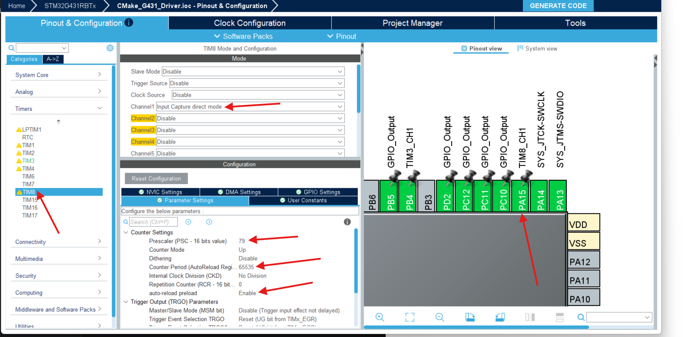
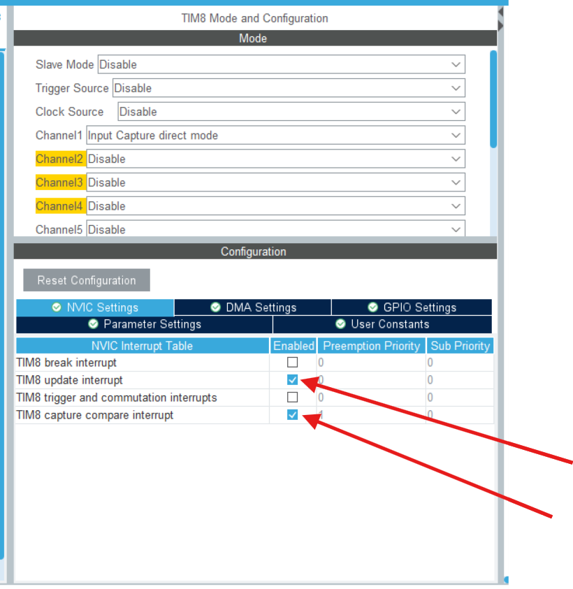

# STM32开发备忘录：定时器输入捕获与测周法计频

作为蓝桥杯省赛年年必考的核心模块，计频器（测量 NE555 产生的方波频率）是一个非常重要的知识点。

实现频率测量主要有两种方法：**测频法**（适合高频）和**测周法**（适合低频）。蓝桥杯板载的 NE555 产生的频率通常在几百到几万赫兹，因此本篇备忘录主要讨论**测周法**。

**测周法原理**：利用 STM32 定时器的“输入捕获”功能，捕获方波的上升沿。记录两次连续上升沿出现的时间差（即一个周期的时间），进而通过 `频率 = 1 / 周期` 算出最终频率。

---

## 1. 硬件引脚映射与分析

首先查看原理图，明确板载信号源的物理连接：


以 **PA15** 引脚为例，查阅引脚映射可知，PA15 对应某个定时器的通道（例如 `TIM8_CH1` 或 `TIM2_CH1`，这里以 **TIM8 通道 1** 为例进行讲解）。

---

## 2. STM32CubeMX 核心配置

打开 CubeMX 进行底层配置：

1. **设置定时器模式**：打开 TIM8，将 Channel 1 设置为 `Input Capture direct mode`（直接输入捕获模式）。
2. **配置时钟参数**：
   * `Prescaler` (预分频系数) 设为 **79**。因为系统主频通常为 80MHz，分频后定时器时钟为 1MHz（即 1秒钟计数 1,000,000 次，每个计数值代表 1微秒）。
   * `Counter Period` (自动重装载值 ARR) 设为 **65535**（16位定时器的最大值）。
   * 开启自动重装载(`auto-reload Period`)
   
   
3. **开启中断 (极其重要)**：
   * 必须打开对应的**捕获中断**（Capture compare interrupt）和**溢出/更新中断**（Update interrupt）。
   * *注：某些定时器（如 TIM3）会将更新和捕获合并成一个全局中断（Global interrupt），只需勾选那一个即可。*
   

---

## 3. 核心代码编写

代码的逻辑分为三步：启动捕获 -> 编写溢出回调 -> 编写捕获回调。

### 3.1 启动输入捕获中断
在 `main.c` 的初始化部分（`/* USER CODE BEGIN 2 */`）启动定时器的输入捕获中断：

```c
// 启动 TIM8 通道 1 的输入捕获中断
HAL_TIM_IC_Start_IT(&htim8, TIM_CHANNEL_1);
```

### 3.2 中断回调逻辑实现
新建或在 `tim.c` 中重写以下两个弱函数：溢出回调 `HAL_TIM_PeriodElapsedCallback` 和 捕获回调 `HAL_TIM_IC_CaptureCallback`。

*(为了代码规范与可读性，对变量命名进行了标准化优化)*

```c
/* tim.c */

// 定义相关时间戳与溢出计数变量
uint32_t capture_now = 0;        // 本次捕获的计数值
uint32_t capture_last = 0;       // 上次捕获的计数值
uint32_t overflow_now = 0;       // 本次捕获时的溢出次数
uint32_t overflow_last = 0;      // 上次捕获时的溢出次数
volatile uint32_t capture_period = 0; // 最终计算出的周期节拍数

// 1. 溢出中断回调：处理定时器计满 65535 归零的情况
void HAL_TIM_PeriodElapsedCallback(TIM_HandleTypeDef *htim)
{
    if (htim->Instance == TIM8)
    {
        overflow_now++; // 每溢出一次，计数器加一
    }
}

// 2. 捕获中断回调：捕获到上升沿时触发
void HAL_TIM_IC_CaptureCallback(TIM_HandleTypeDef *htim)
{
    if (htim->Instance == TIM8)
    {
        // 获取当前捕获寄存器的值
        capture_now = HAL_TIM_ReadCapturedValue(htim, TIM_CHANNEL_1);
        
        // 计算两次上升沿之间的总节拍数：当前差值 + 溢出次数带来的节拍补偿
        capture_period = (capture_now - capture_last) + (overflow_now - overflow_last) * 65536;
        
        // 更新历史状态，为下一次捕获做准备
        capture_last = capture_now;
        overflow_last = overflow_now;
        
    }
}
```


### 3.3 频率计算与 LCD 显示

在需要使用数据的地方（例如 `main.c` 的 `while(1)` 或专属的 UI 处理函数中），将周期换算为频率：

```c
/* tim.h */
// 别忘了在头文件中声明这个变量，以便外部调用
extern volatile uint32_t capture_period;

/* main.c / function.c */

uint32_t capture_freq = 0; // 存放最终频率

// 前文提到定时器 1 秒计数 1M 次 (1,000,000)
// 用 1M 除以一个周期所占的计数值，就是 1 秒内有多少个周期（即频率 Hz）
if (capture_period != 0) // 防止除以 0 导致硬件错误
{
    capture_freq = 1000000 / capture_period;
}

// LCD 动态显示，利用 "%-20s" 消除旧数据残影
char LCD_DataTemp[30];
char LCD_DataLine2[30];

sprintf(LCD_DataTemp, "    PWM1 = %lu Hz", capture_freq);
sprintf(LCD_DataLine2, "%-20s", LCD_DataTemp);
LCD_DisplayStringLine(Line2, (uint8_t*)LCD_DataLine2);
```

---

自此，我们就完成了一个严谨、防溢出且不闪屏的定时器计频器逻辑代码。