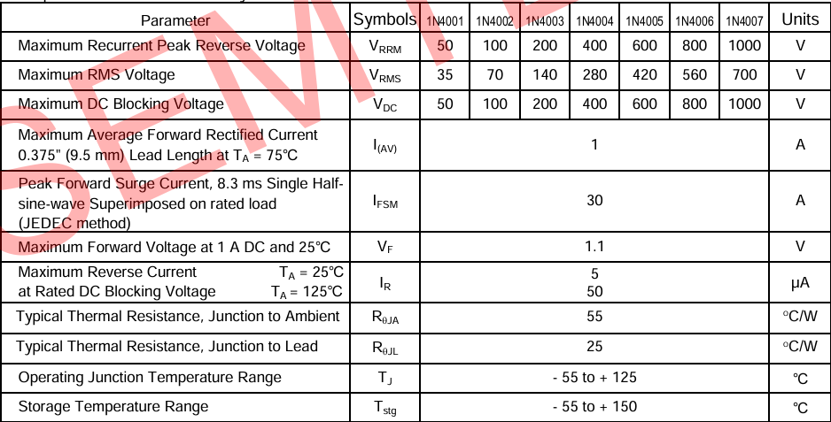
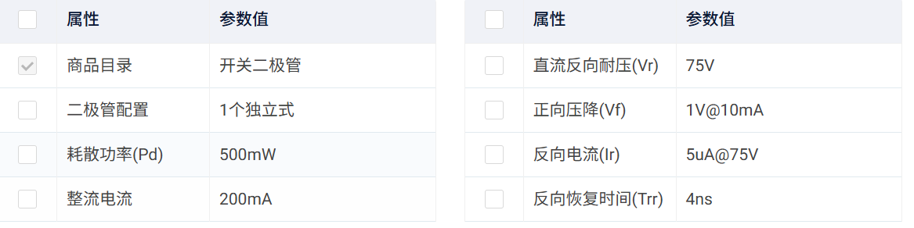
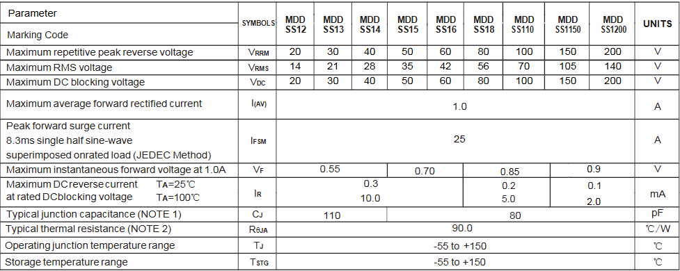

---
---
title: 常用二极管整理
date: 2026-03-28 21:47:00
math: true
tags: [CI/CD, 硬件设计, 基础元件]
categories: 元器件
---
# 常用二极管特性、分类及型号选型指南

二极管（Diode）是电子电路中最基础的半导体器件之一。本文旨在整理二极管的核心特性、常见分类以及在开发中高频使用的型号参数，方便查阅与选型。

---

## 一、 二极管的核心物理特性

在深入型号前，需掌握以下三个关键电性能参数：

1. **正向压降 ($V_F$)**：二极管导通时两端的电压。硅管通常为 $0.6V \sim 0.7V$，肖特基二极管约为 $0.2V \sim 0.3V$。
2. **反向重复峰值电压 ($V_{RRM}$)**：二极管能承受的最大反向电压，超过此值可能导致击穿。
3. **反向恢复时间 ($t_{rr}$)**：二极管从导通状态截止时所需的时间。该参数决定了二极管能工作的最高频率。

---

## 二、 常用二极管分类及应用场景

| 类别 | 特点 | 典型应用 |
| :--- | :--- | :--- |
| **整流二极管** | 耐压高、电流大、工作频率低 | 电源整流（AC 转 DC） |
| **肖特基二极管 (SBD)** | 压降低、开关速度极快、反向漏电流稍大 | 高频开关电源、续流、防反接 |
| **稳压二极管 (Zener)** | 利用反向击穿特性稳定电压 | 电压基准、过压保护、钳位电路 |
| **开关二极管** | 结电容小、反应速度极快 | 信号处理、数字逻辑电路 |
| **快恢复二极管 (FRD)** | 反向恢复时间短，耐压较高 | 大功率逆变器、PWM 控制 |
---

## 三、 常用型号参数汇总

以下是电子设计中最常见的“常青树”型号，建议博客中重点留存：

### 1. 1N4007 —— 通用硅整流管
这是最经典的整流二极管，几乎见于所有低频交流转直流的电路中。
* **最大正向电流 ($I_O$)**: $1.0A$
* **最高反向耐压 ($V_{RRM}$)**: $1000V$
* **正向压降 ($V_F$)**: $1.1V$ (典型值)
* **应用**: 50Hz/60Hz 市电整流。
* 

### 2. 1N4148 —— 高速开关管
玻璃封装，体积小，响应极快，处理小信号的首选。
* **反向恢复时间 ($t_{rr}$)**: $4ns$
* **最大正向电流**: $200mA \sim 300mA$
* **反向耐压**: $100V$
* **应用**: 信号检测、电平转换、高频触发。
* 

### 3. SS14 / SS34 —— 肖特基二极管 (贴片)
在低压电路（如 5V/12V）中应用极广，效率高。
* **正向压降 ($V_F$)**: 约 $0.5V$
* **最大电流**: $1.0A$ (SS14) / $3.0A$ (SS34)
* **反向耐压**: $40V$
* **应用**: 电池供电防反接、DC-DC 升降压电路续流。

### 4. BZX84C5V1 —— 稳压管 (贴片)
* **稳压值 ($V_Z$)**: $5.1V$
* **功率**: $350mW$
* **应用**: 为单片机 IO 口提供过压保护，或产生基准电压。

---

## 四、 选型与使用建议

1. **降额设计**：实际工作电压建议不超过 $V_{RRM}$ 的 **80%**，电流不超过 $I_O$ 的 **70%**，以确保系统可靠性。
2. **散热考量**：在大电流应用中，即使压降只有 $0.5V$，在 $3A$ 电流下也会产生 $1.5W$ 的发热量，需注意 PCB 铺铜散热。
3. **极性识别**：
    * **直插**：有色环的一端为**负极 (Cathode)**。
    * **发光二极管 (LED)**：长脚为正，短脚为负；内部大片的一端为负。

---

> **本文由 AI 协作整理，转载请注明出处。**